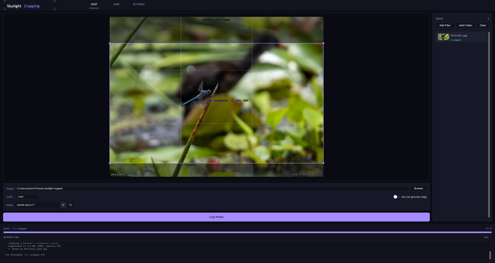

# Skylight Cropping

**AI-powered 16:9 photo cropping for Windows and macOS.**
Claude finds your subject — you get a clean widescreen frame.



---

## Why this exists

Skylight digital frames don't cleanly display 16:9 photos unless you feed them a *mix* of aspect ratios for the frame to arrange together. With a uniform library that never happens — the frame letterboxes every shot.

All my photos come from a Micro Four Thirds camera (a 4:3 sensor), so every image needs cropping to 16:9 before it looks right on the frame. Doing that by hand for thousands of bird and wildlife photos — and keeping the subject well-framed each time — was tedious. So I automated it: Claude looks at each photo, finds the subject, and crops to a clean 16:9 that actually keeps the animal in frame.

---

## What it does

🎯 **Smart subject detection**
Claude identifies the primary subject (*"great blue heron"*, *"blue dragonfly"*), draws a bounding box around its body mass — deliberately excluding extremities like beaks, tails, and wingtips — and targets the geometric centre. The crop frames the animal, not its beak tip. If Claude can't find a clear subject, the photo is skipped and reported — there is **no silent fallback to centre-cropping**.

🖱️ **One-click target adjustment**
Don't like where the target landed? Click anywhere on the preview to move it. The crop box updates instantly and the file re-saves in the background — no re-analysing, no extra API call.

👁️ **Live preview as you crop**
Watch each crop happen in real time — target point (crosshair + circle), 16:9 crop box, dimmed surroundings, rule-of-thirds grid. Results persist per-image so you can click back through the queue after a batch finishes to review any crop.

📦 **Batch processing**
Add individual files or entire folders. A live progress bar (`2 / 7`) and per-item status dots (● analyzing → ● cropped / ● failed) keep you informed throughout.

🔍 **Dry run mode**
Preview every crop box before writing a single file. Toggle **Dry run** in the controls.

📬 **Email delivery**
The **Send** tab emails each cropped photo as an individual message — handy for sending straight to a digital photo frame. Uses Yahoo Mail by default: after trying several providers, Yahoo gave the most consistent behaviour with the least aggressive rate limiting and filtering. The SMTP host and port are configurable if you prefer something else.

---

## Getting the app

### Option A — download a prebuilt binary (easiest)

No Python, no building required.

- **Latest release:** go to the repo's **Releases** page and download `SkylightCropping-windows.zip` (Windows) or `SkylightCropping` (macOS).
- **Latest build:** open the **Actions** tab → most recent "Build App" run → download the **SkylightCropping-windows** or **SkylightCropping-mac** artifact. Build artifacts are kept for 7 days; tagged releases are permanent.

On Windows, unzip the download and run `SkylightCropping.exe` from inside the extracted folder. On macOS, just run the downloaded binary — nothing to install.

### Option B — run from source

1. Install [Python 3.11+](https://python.org/downloads) (check "Add Python to PATH" on Windows)
2. Install dependencies:
   ```
   pip install -r requirements.txt
   ```
3. Launch the app:
   ```
   python app.py
   ```

### Option C — build the binary locally

```
build.bat       # Windows → dist\SkylightCropping\SkylightCropping.exe
```

---

## First-time setup

Open the **Settings** tab and fill in:

| Field | What to enter |
|---|---|
| Anthropic API Key | From [console.anthropic.com](https://console.anthropic.com) → API Keys |
| Model | Any Claude model (default: `claude-opus-4-7`) |
| To Email | Your Skylight frame's email address *(optional, for Send)* |
| Yahoo App Password | [myaccount.yahoo.com](https://myaccount.yahoo.com) → Security → App passwords *(optional, for Send)* |
| From Email | Your Yahoo address *(optional, for Send)* |

Click **Save Settings**. No environment variables needed. The app remembers your selected photos, folders, and settings between sessions, and fetches the current list of available Claude models from Anthropic — use the **↻** button to refresh.

### Which model should I use?

`claude-opus-4-7` gives the most reliable subject targeting. `claude-sonnet-4-6` is cheaper and works well too — one-click target adjustment makes fixing any miss trivial either way.

---

## How it works

1. Each image is sent to the Claude API (vision).
2. Claude identifies the subject and returns a bounding box around its body mass.
3. The app computes the largest 16:9 rectangle centred on that box, clamped to the image edges.
4. The cropped image is saved — the original is untouched.

---

## Troubleshooting

The packaged app runs windowed (no console), so if it hangs on startup or
crashes silently, check the log file instead:

- **Windows / Linux:** `%USERPROFILE%\.skylight_cropping\app.log`
- **macOS:** `~/Library/Application Support/SkylightCropping/app.log`

Click **Open log** in the bottom-right of the app window to jump straight to
the folder. The log records startup timing (settings load, keyring access,
UI build) plus any uncaught exceptions or Tk callback errors, which is the
most useful thing to attach when reporting a bug.

---

## Supported formats

JPEG · PNG · WebP · GIF
